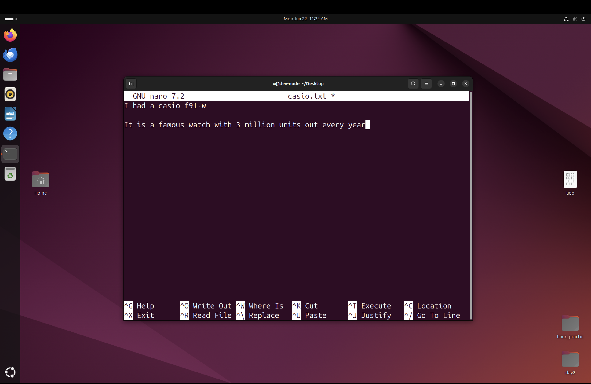

# Text Editors in Linux

Linux provides several text editors for creating and modifying files.

## Nano

Nano is a beginner-friendly terminal text editor.

Create or edit a file:

```bash
nano notes.txt
```

Advantages:
- Easy to learn
- Shortcut keys shown at the bottom
- Good for quick edits

Common Shortcuts:

- Ctrl + O | Save file
- Ctrl + X | Exit 
- Ctrl + K | Cut line 
- Ctrl + U | Paste line 


## Vim

Vim is a powerful and highly customizable text editor.

Open a file:

```bash
vim notes.txt
```

### Modes in Vim

1. Normal Mode
2. Insert Mode
3. Command Mode

Press:

```text
i
```

to enter Insert Mode.

Press:

```text
Esc
```

to return to Normal Mode.

### Saving and Exiting

Save and quit:

```text
:wq
```

Quit without saving:

```text
:q!
```

Advantages:
- Extremely powerful
- Fast for experienced users
- Available on almost every Linux system


## Cybersecurity Relevance

Many Linux servers do not have a graphical interface.

Security professionals often edit:
- Configuration files
- Log files
- Service settings
- Scripts

using terminal-based editors such as Nano and Vim.

## Nano Example


