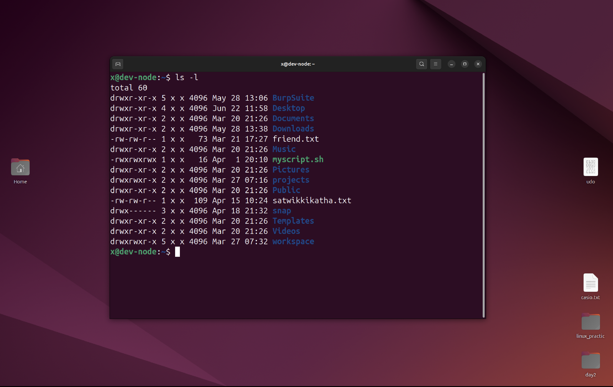

# Permissions in Linux

Linux uses a permission system to control who can read, modify or execute files and directories. Permissions are commonly managed
using chmod command.

## Viewing permissions

permissions can be viewed using:
```bash
ls -l
```

Example output:
```text
-rwx-wx-wx
```


