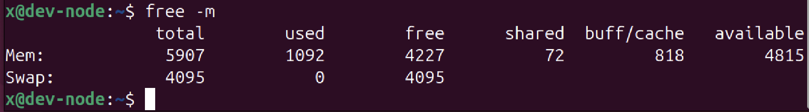
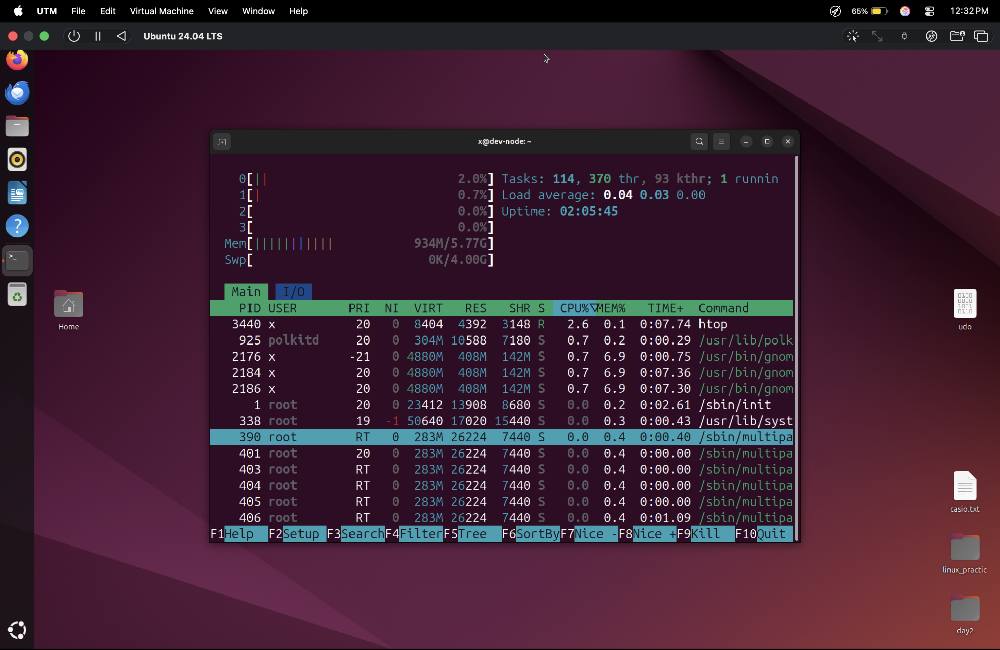

# System Monitoring in Linux

System monitoring commands help users understand how system resources such as memory, storage, CPU, and running processes are being utilized.

## free -m

Displays memory usage in megabytes (MB).

```bash
free -m
```


### Information Displayed

- Total memory
- Used memory
- Free memory
- Shared memory
- Swap memory

This command is useful for checking RAM usage and diagnosing memory-related issues.


## df -h

Displays disk usage in a human-readable format.

```bash
df -h
```

### Information Displayed

- Total disk space
- Used disk space
- Available disk space
- Percentage of disk usage

The `-h` flag displays sizes in KB, MB, or GB instead of raw bytes.


## df -i

Displays inode usage for mounted filesystems.

```bash
df -i
```

### What is an Inode?

An inode stores metadata about a file such as:

- File owner
- Permissions
- File size
- Timestamps

A system can run out of inodes even when disk space is still available.


## htop

An interactive system monitoring utility.

```bash
htop
```

### Features

- Real-time CPU usage
- Memory usage
- Running processes
- Process IDs (PID)
- User information

Compared to `top`, htop provides a more user-friendly and interactive interface.
## on screen:


## uptime

Displays how long the system has been running since the last reboot.

```bash
uptime
```

### Example Output

```text
14:32:01 up 5 days, 3:17, 2 users, load average: 0.12, 0.08, 0.05
```

### Information Displayed

- Current time
- System uptime
- Number of logged-in users
- System load averages


## Cybersecurity Relevance

System monitoring is important for both system administrators and cybersecurity professionals.

These commands help:

- Detect unusual resource consumption
- Identify suspicious processes
- Monitor system stability
- Investigate performance issues
- Recognize potential indicators of compromise

For example, an unknown process consuming excessive CPU or memory may indicate malware or unauthorized activity.


## Summary

### Useful Commands

```bash
free -m
df -h
df -i
htop
uptime
```

These commands provide information about memory usage, disk space, inode usage, running processes, and system uptime.
