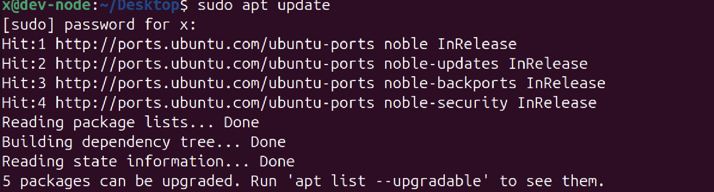

# Linux Package Management (APT)


## what is APT?

APT stands for Advanced Package Tool. This is used in debian based distributions like:
- ubuntu
- kali
- linux Mint
It helps to install, remove and search packages.

## Repository
A repository is a server that stores packages. It is like the app store of linux. These are maintained usually by 
distribution-providers and companies.

Eg:
```text
Ubuntu Linux Repo:
- Apache2
- firefox
- Vim
```
When you istall a package with a command like 'sudo apt install apache2', APT installs it from the repository.

## Repository index

Linux doesn't always asks repositories about package information. Instead it maintaons a local database which contains details 
about packages.

eg:
```text
Package: apache2
Version: 2.4.58
Description: Apache Web Server
```
#### Note:
The Repo Index contains details of the packages available in the repository locally. To see the packages downloaded locally, one can use the command:
```bash
dpkg -l
```
### sudo apt update
This command updates the repository index. 

APT contacts the repositories and downloads the latest information about available packages and versions.
eg: 



### sudo apt upgrade
This actually installs the packages in the system.

### sudo apt remove <package>
This removes the downloaded package from the system.
### sudo apt autoremove
This command removes the additional necessary packages downloaded with the actual reqired package.


  
